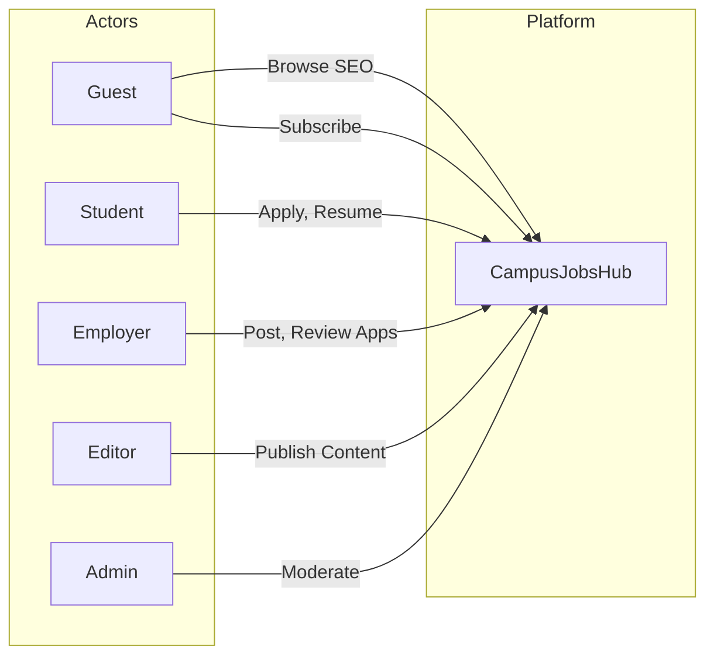
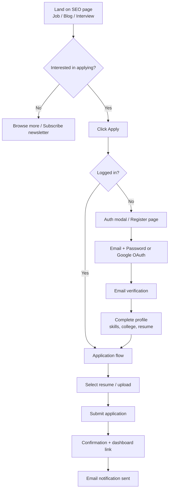
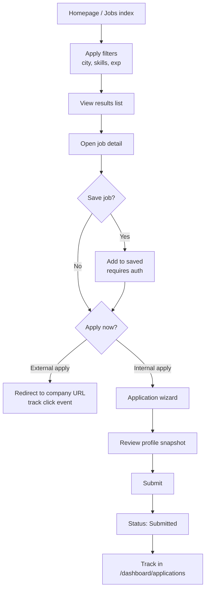
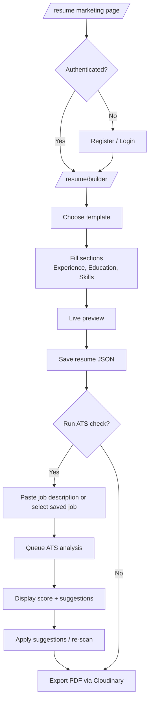
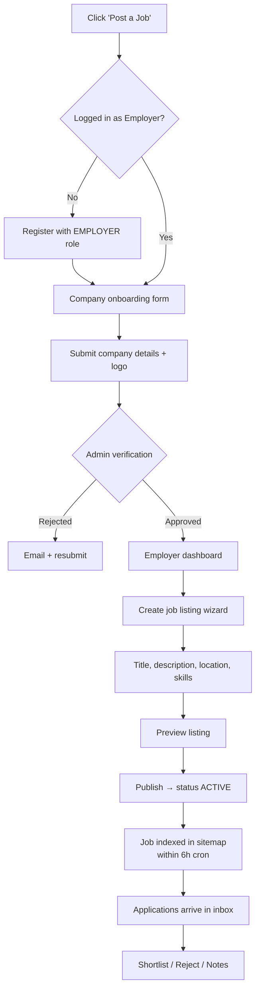
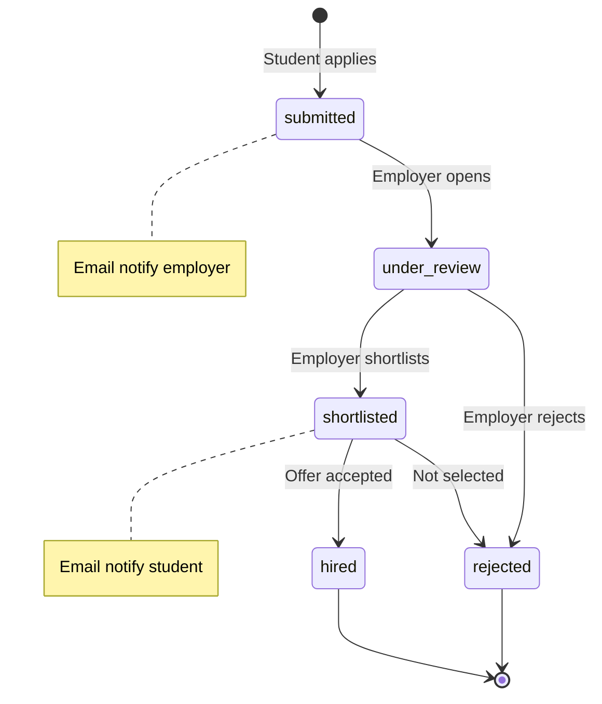
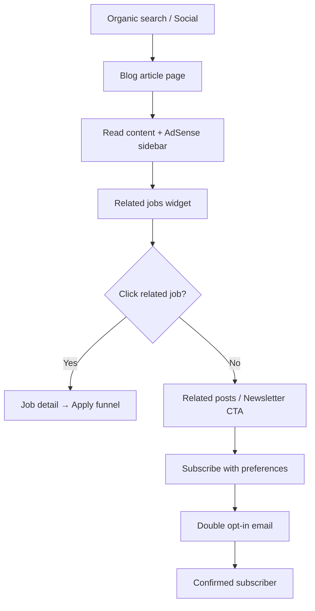
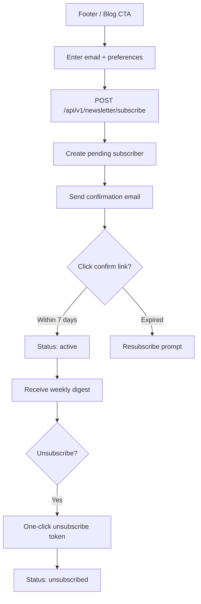
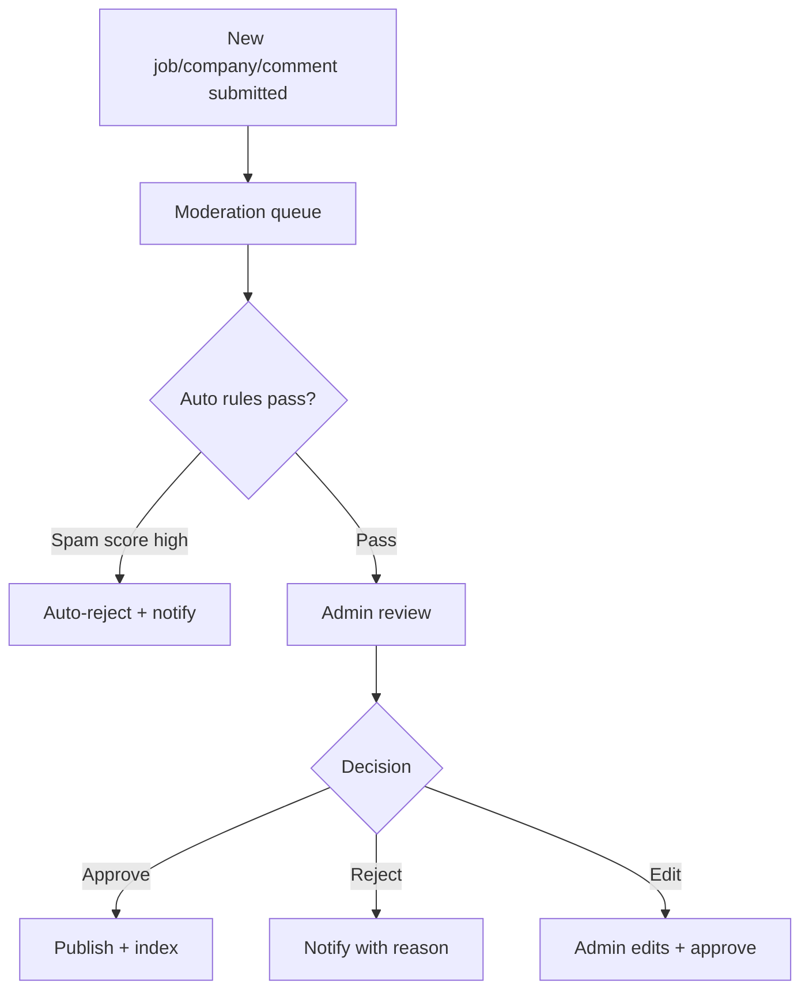
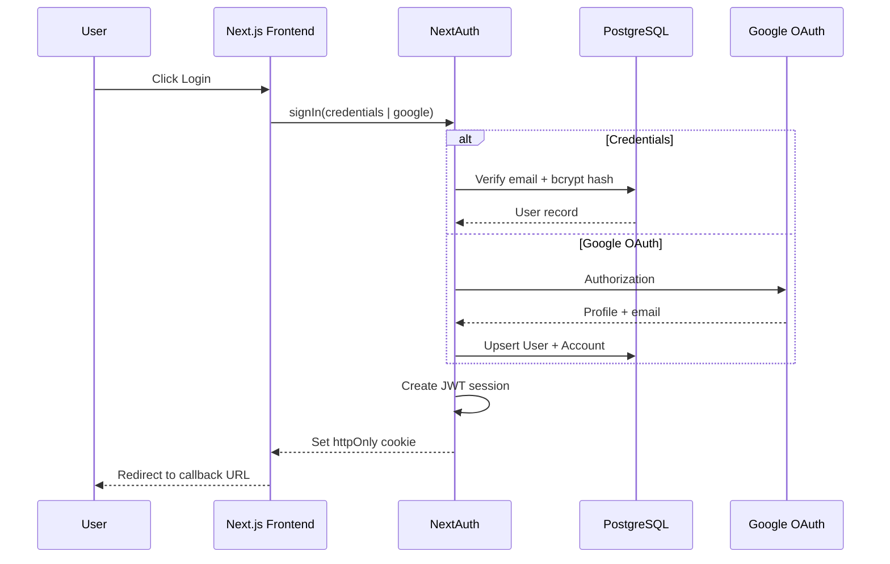

# User Flow Diagrams

## 1. Persona Overview

---

## 2. Guest → Student Conversion Flow

---

## 3. Job Search & Apply Flow (Student)

---

## 4. Resume Builder & ATS Flow

---

## 5. Employer Onboarding & Job Post Flow

---

## 6. Application Status Flow (State Machine)

---

## 7. Blog & Content Consumption Flow

---

## 8. Newsletter Subscription Flow

---

## 9. Admin Moderation Flow

---

## 10. Authentication Flow (NextAuth)

---

## 11. Error & Edge Case Flows

| Scenario | Behavior |
|----------|----------|
| Apply to expired job | Block submit; show similar jobs |
| Duplicate application | Show existing application status |
| ATS rate limit exceeded | Upsell message; retry after 24h |
| Unverified email | Allow browse; block apply |
| Employer unverified | Jobs saved as `pending_review` |
| Session expired mid-apply | Save draft in localStorage; re-auth resume |

---

## 12. Notification Touchpoints

| Event | Channel | Recipient |
|-------|---------|-----------|
| Application submitted | Email + in-app | Student, Employer |
| Status change | Email + in-app | Student |
| New job match (saved search) | Email | Student (Phase 2) |
| Job expiring in 3 days | Email | Employer |
| Newsletter weekly | Email | Subscriber |
| Comment reply | Email | Comment author (Phase 2) |
