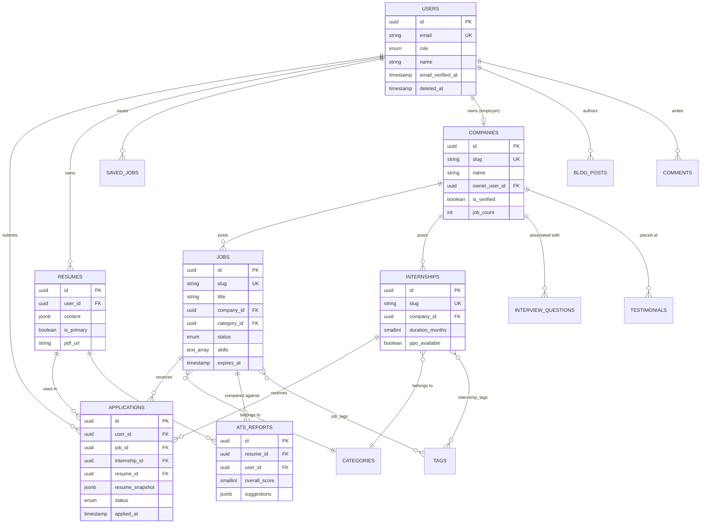
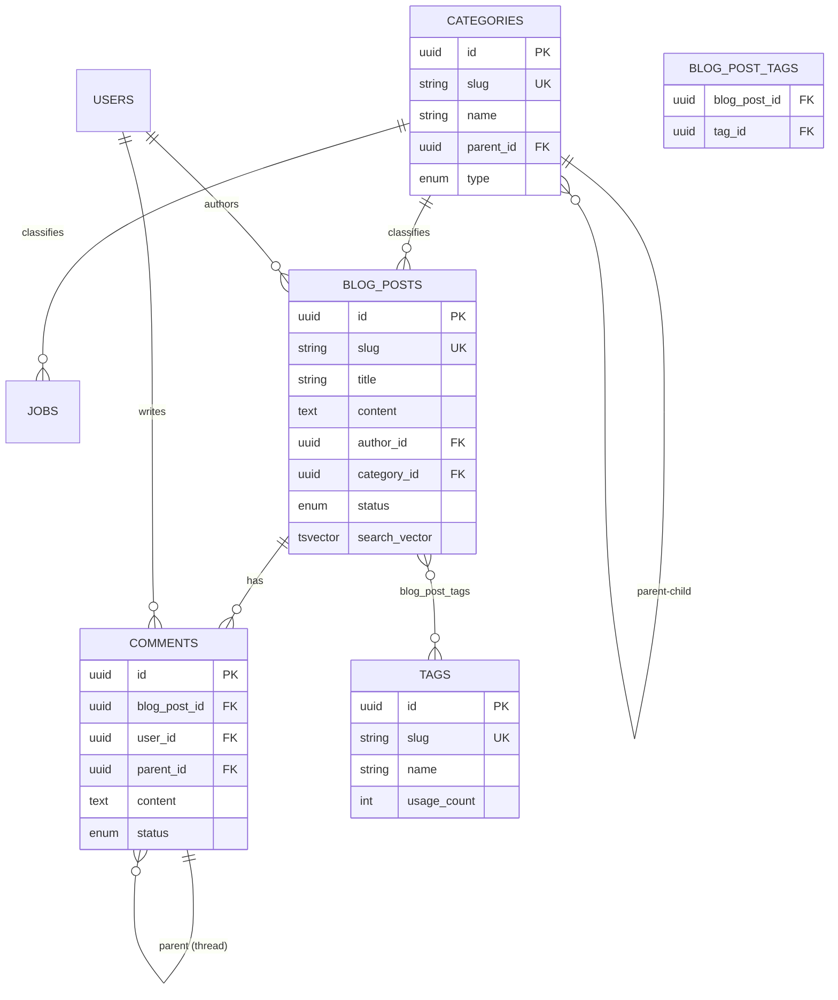
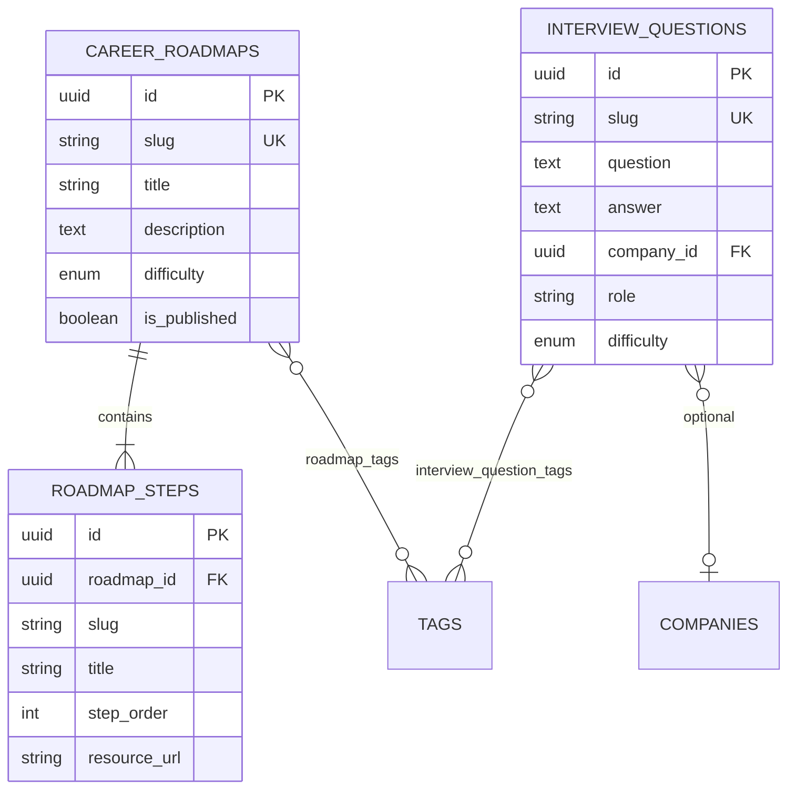
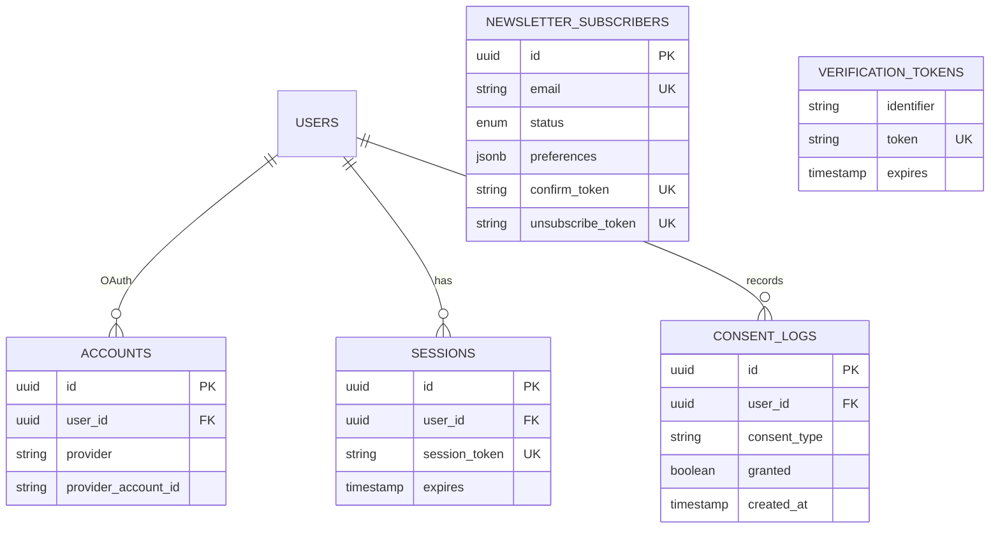
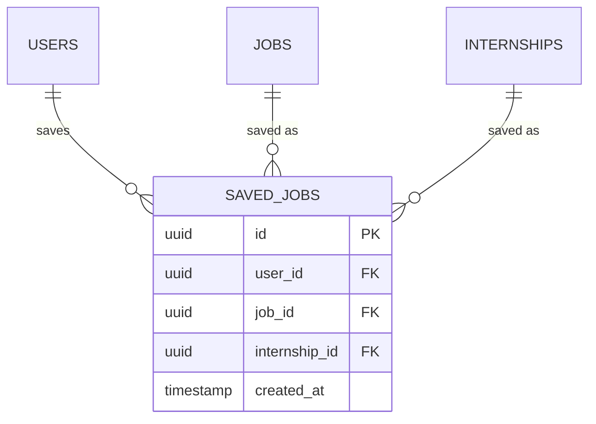
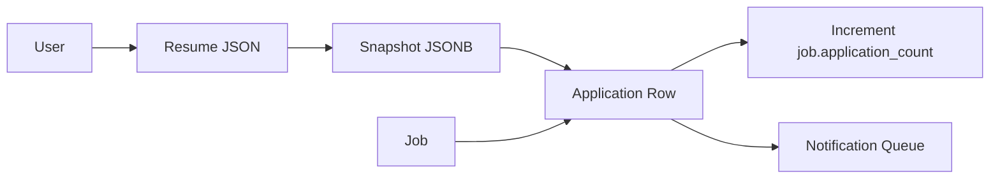
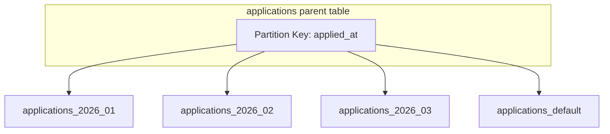

# ER Diagrams

## 1. Core Domain — Jobs & Applications

---

## 2. Content Domain — Blog & Taxonomy

---

## 3. Placement Prep Domain

---

## 4. Auth & Newsletter Domain

---

## 5. Saved Jobs Junction

**Constraint:** Exactly one of `job_id` or `internship_id` must be set.

---

## 6. Relationship Cardinality Summary

| From | To | Relationship | FK Location |
|------|-----|--------------|-------------|
| User | Application | 1:N | applications.user_id |
| User | Resume | 1:N | resumes.user_id |
| User | Company | 1:1 (owner) | companies.owner_user_id |
| Company | Job | 1:N | jobs.company_id |
| Company | Internship | 1:N | internships.company_id |
| Job | Application | 1:N | applications.job_id |
| Resume | Application | 1:N | applications.resume_id |
| Resume | ATSReport | 1:N | ats_reports.resume_id |
| BlogPost | Comment | 1:N | comments.blog_post_id |
| Category | Category | 1:N (tree) | categories.parent_id |
| CareerRoadmap | RoadmapStep | 1:N | roadmap_steps.roadmap_id |
| Job ↔ Tag | M:N | job_tags junction |
| BlogPost ↔ Tag | M:N | blog_post_tags junction |

---

## 7. Data Flow — Application Submit

---

## 8. Partitioning Diagram — Applications

Queries always include `applied_at` range for partition pruning.
