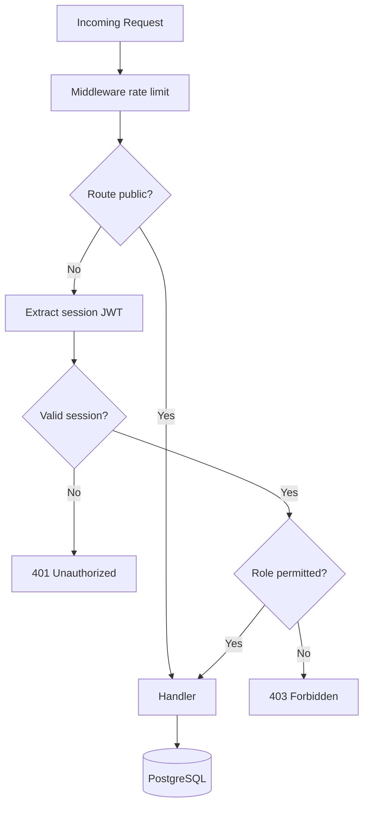

# API Architecture

## 1. Overview

**Style:** REST over Next.js App Router API routes  
**Base URL:** `https://campusjobshub.com/api/v1`  
**Format:** JSON (`application/json`)  
**Auth:** NextAuth JWT session cookie + optional `Authorization: Bearer` for future mobile  
**Versioning:** URL path (`/v1/`); breaking changes → `/v2/`

---

## 2. Response Envelope

### Success

```json
{
  "success": true,
  "data": { },
  "meta": {
    "page": 1,
    "limit": 20,
    "total": 150,
    "hasMore": true
  }
}
```

### Error

```json
{
  "success": false,
  "error": {
    "code": "VALIDATION_ERROR",
    "message": "Invalid input",
    "details": [
      { "field": "email", "message": "Invalid email format" }
    ]
  }
}
```

### Standard HTTP Status Codes

| Code | Usage |
|------|-------|
| 200 | GET, PATCH success |
| 201 | POST create |
| 204 | DELETE success |
| 400 | Validation error |
| 401 | Unauthenticated |
| 403 | Forbidden (RBAC) |
| 404 | Not found |
| 409 | Conflict (duplicate application) |
| 422 | Business rule violation |
| 429 | Rate limited |
| 500 | Internal error |

---

## 3. Authentication on API Routes



**Public routes:** Job/internship listing GET, blog GET, search GET, newsletter subscribe  
**Authenticated:** Applications, resumes, saved jobs, employer CRUD  
**Admin only:** Moderation, user management

---

## 4. Endpoint Catalog

### 4.1 Jobs

| Method | Endpoint | Auth | Description |
|--------|----------|------|-------------|
| GET | `/jobs` | Public | List with filters |
| GET | `/jobs/:id` | Public | Job detail by ID or slug |
| POST | `/jobs` | Employer | Create job |
| PATCH | `/jobs/:id` | Employer/Admin | Update job |
| DELETE | `/jobs/:id` | Employer/Admin | Soft delete |
| GET | `/jobs/search` | Public | Full-text search |

**Query params (GET /jobs):**

```
?page=1&limit=20&city=mumbai&category=software-engineering
&experience_min=0&experience_max=2&remote=true
&sort=published_at&order=desc
```

### 4.2 Internships

Mirror `/jobs` with internship-specific filters: `duration_min`, `stipend_min`, `ppo=true`

### 4.3 Companies

| Method | Endpoint | Auth | Description |
|--------|----------|------|-------------|
| GET | `/companies` | Public | List verified companies |
| GET | `/companies/:slug` | Public | Company profile + listings |
| POST | `/companies` | Employer | Register company |
| PATCH | `/companies/:id` | Employer/Admin | Update profile |
| POST | `/companies/:id/verify` | Admin | Verify company |

### 4.4 Applications

| Method | Endpoint | Auth | Description |
|--------|----------|------|-------------|
| GET | `/applications` | Student/Employer | List (scoped by role) |
| GET | `/applications/:id` | Owner/Employer | Detail |
| POST | `/applications` | Student | Submit application |
| PATCH | `/applications/:id` | Employer | Update status/notes |
| DELETE | `/applications/:id` | Student | Withdraw |

**POST body:**

```json
{
  "jobId": "uuid",
  "resumeId": "uuid",
  "coverLetter": "optional string"
}
```

### 4.5 Resumes

| Method | Endpoint | Auth | Description |
|--------|----------|------|-------------|
| GET | `/resumes` | Student | List user resumes |
| GET | `/resumes/:id` | Student | Get resume |
| POST | `/resumes` | Student | Create resume |
| PATCH | `/resumes/:id` | Student | Update content |
| DELETE | `/resumes/:id` | Student | Soft delete |
| POST | `/resumes/:id/ats` | Student | Run ATS analysis |
| GET | `/resumes/:id/ats` | Student | List ATS reports |
| POST | `/resumes/:id/export` | Student | Generate PDF → Cloudinary |

### 4.6 Blog

| Method | Endpoint | Auth | Description |
|--------|----------|------|-------------|
| GET | `/blog` | Public | List published posts |
| GET | `/blog/:slug` | Public | Post detail |
| POST | `/blog` | Editor/Admin | Create post |
| PATCH | `/blog/:id` | Editor/Admin | Update |
| DELETE | `/blog/:id` | Admin | Archive |

### 4.7 Comments

| Method | Endpoint | Auth | Description |
|--------|----------|------|-------------|
| GET | `/comments?postId=` | Public | Approved comments |
| POST | `/comments` | Student+ | Submit (pending moderation) |
| PATCH | `/comments/:id` | Admin | Approve/reject |

### 4.8 Interview Questions & Roadmaps

| Method | Endpoint | Auth |
|--------|----------|------|
| GET | `/interview-questions` | Public |
| GET | `/interview-questions/:slug` | Public |
| GET | `/roadmaps` | Public |
| GET | `/roadmaps/:slug` | Public |
| POST/PATCH | `/*` | Editor/Admin |

### 4.9 Newsletter

| Method | Endpoint | Auth |
|--------|----------|------|
| POST | `/newsletter/subscribe` | Public |
| GET | `/newsletter/confirm?token=` | Public |
| GET | `/newsletter/unsubscribe?token=` | Public |

### 4.10 Saved Jobs

| Method | Endpoint | Auth |
|--------|----------|------|
| GET | `/saved-jobs` | Student |
| POST | `/saved-jobs` | Student |
| DELETE | `/saved-jobs/:id` | Student |

### 4.11 Upload (Cloudinary)

| Method | Endpoint | Auth |
|--------|----------|------|
| POST | `/upload/signature` | Authenticated |
| POST | `/upload/avatar` | Authenticated |
| POST | `/upload/company-logo` | Employer |

Returns signed upload params; client uploads direct to Cloudinary.

### 4.12 Global Search

```
GET /search?q=software+engineer&type=jobs,internships,blog&limit=10
```

### 4.13 Admin

| Method | Endpoint | Auth |
|--------|----------|------|
| GET | `/admin/analytics` | Admin |
| POST | `/admin/moderate` | Admin |
| GET | `/admin/users` | Admin |

### 4.14 System

| Method | Endpoint | Auth |
|--------|----------|------|
| GET | `/health` | Public |
| POST | `/revalidate` | Webhook secret |

---

## 5. Rate Limiting

| Tier | Limit | Window |
|------|-------|--------|
| Public read | 100 req | 1 min / IP |
| Authenticated | 300 req | 1 min / user |
| POST applications | 10 | 1 hour / user |
| ATS scans | 5 | 24 hours / user |
| Newsletter subscribe | 3 | 1 hour / IP |
| Auth login | 5 | 15 min / IP |

Implementation: Redis sliding window via `shared/lib/rate-limit.ts`

---

## 6. Caching Strategy

| Endpoint | Cache | TTL |
|----------|-------|-----|
| GET /jobs (list) | CDN + Redis | 120s |
| GET /jobs/:slug | ISR + Redis | 300s |
| GET /blog/:slug | ISR | 3600s |
| GET /companies/:slug | ISR + Redis | 600s |
| POST/PATCH/DELETE | No cache | Invalidate tags |

**Cache invalidation:** Next.js `revalidateTag('job:{slug}')` on write.

---

## 7. Validation Layer

- **Zod schemas** in `features/*/schemas/`
- Validate at API route boundary before DB access
- Shared error formatter in `shared/lib/api-response.ts`

---

## 8. Pagination

**Offset (default):** `?page=1&limit=20` — max limit 100  
**Cursor (Phase 3):** `?cursor=base64&limit=20` for applications feed

---

## 9. Idempotency

POST `/applications` accepts optional header:

```
Idempotency-Key: <uuid>
```

Stored in Redis 24h to prevent duplicate submits on retry.

---

## 10. Webhooks (Future)

| Event | Consumer |
|-------|----------|
| `application.created` | Employer email service |
| `job.published` | Sitemap generator, Meilisearch |
| `ats.completed` | Notification service |

---

## 11. OpenAPI

Generate from Zod schemas using `zod-to-openapi` in CI → `docs/api/openapi.v1.json`

---

## 12. API Route File Pattern

```
src/app/api/v1/jobs/route.ts        → GET (list), POST (create)
src/app/api/v1/jobs/[id]/route.ts   → GET, PATCH, DELETE
```

Each route file:
1. Parse & validate input
2. Check auth + RBAC
3. Apply rate limit
4. Call feature service layer (not raw DB in route)
5. Return envelope
