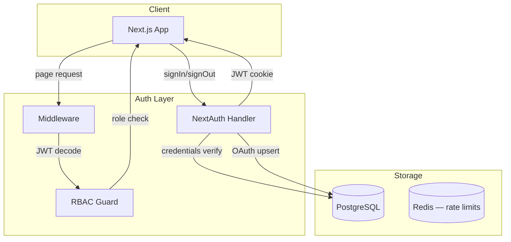

# Authentication Architecture

## 1. Overview

**Provider:** NextAuth.js v5 (Auth.js)  
**Session strategy:** JWT (stateless, VPS-friendly) with optional DB session fallback  
**Primary methods:** Email/password + Google OAuth  
**Future:** LinkedIn OAuth (employer verification)

---

## 2. Auth Flow Architecture



---

## 3. Providers Configuration

### 3.1 Credentials Provider

| Step | Action |
|------|--------|
| 1 | User submits email + password |
| 2 | Lookup `users` by email (case-insensitive) |
| 3 | Verify `bcrypt` hash (cost factor 12) |
| 4 | Check `is_active` and `deleted_at IS NULL` |
| 5 | Check `email_verified_at` for protected actions |
| 6 | Issue JWT with `sub`, `role`, `email`, `name` |
| 7 | Update `last_login_at` |

### 3.2 Google OAuth

| Step | Action |
|------|--------|
| 1 | OAuth consent → profile + email |
| 2 | Upsert `accounts` table |
| 3 | Create `users` if new (auto `email_verified_at`) |
| 4 | Default role: `student` (employer selects at register) |

---

## 4. JWT Session Structure

```json
{
  "sub": "user-uuid",
  "email": "user@example.com",
  "name": "Priya Sharma",
  "role": "student",
  "emailVerified": true,
  "iat": 1717776000,
  "exp": 1720368000
}
```

| Setting | Value |
|---------|-------|
| Algorithm | HS256 |
| Max age | 30 days |
| Refresh | Sliding window on activity (Phase 2) |
| Storage | `httpOnly`, `secure`, `sameSite=lax` cookie |

**Never store in JWT:** password hash, PII beyond name/email, permissions array (derive from role).

---

## 5. Role-Based Access Control (RBAC)

### Roles

| Role | Description |
|------|-------------|
| `student` | Default; apply, resume, save jobs |
| `employer` | Company owner; post jobs, view applications |
| `editor` | Blog, interview questions, roadmaps |
| `admin` | Full platform access |

### Permission Matrix

| Resource | student | employer | editor | admin |
|----------|---------|----------|--------|-------|
| Browse jobs | ✓ | ✓ | ✓ | ✓ |
| Apply to jobs | ✓ | — | — | ✓ |
| Create job | — | ✓ (verified co.) | — | ✓ |
| Manage own applications | ✓ | — | — | ✓ |
| View received applications | — | ✓ (own listings) | — | ✓ |
| Resume builder | ✓ | — | — | ✓ |
| ATS scan | ✓ | — | — | ✓ |
| Publish blog | — | — | ✓ | ✓ |
| Moderate comments | — | — | ✓ | ✓ |
| Verify companies | — | — | — | ✓ |
| User management | — | — | — | ✓ |

### Implementation

```typescript
// shared/lib/auth/rbac.ts
const PERMISSIONS = {
  'jobs:create': ['employer', 'admin'],
  'applications:review': ['employer', 'admin'],
  'blog:publish': ['editor', 'admin'],
  // ...
};
```

Middleware checks route prefix → required role:

| Route Prefix | Min Role |
|--------------|----------|
| `/dashboard` | student |
| `/employer` | employer |
| `/admin` | admin |
| `/resume/builder` | student |

---

## 6. Registration Flows

### Student Registration

1. `/auth/register` — name, email, password, role=student
2. Hash password → create user
3. Send verification email (`verification_tokens`)
4. Redirect to verify prompt
5. On verify → `email_verified_at = NOW()`

### Employer Registration

1. Same form with role=employer
2. Post-verify → redirect `/employer/onboarding`
3. Company creation → `pending_review` until admin verifies

---

## 7. Password Security

| Policy | Value |
|--------|-------|
| Min length | 8 characters |
| Complexity | 1 upper, 1 lower, 1 number |
| Hashing | bcrypt, cost 12 |
| Reset token | 32-byte random, 1 hour expiry |
| Reset flow | POST email → token link → new password |
| Breach check | HaveIBeenPwned API (Phase 2) |

---

## 8. Email Verification

- Token stored in `verification_tokens` table
- Link: `/auth/verify-email/[token]`
- Unverified users: can browse, cannot apply or post
- Resend cooldown: 60 seconds

---

## 9. Middleware Configuration

```typescript
// src/middleware.ts
export const config = {
  matcher: [
    '/dashboard/:path*',
    '/employer/:path*',
    '/admin/:path*',
    '/resume/builder',
    '/resume/ats-checker',
    '/api/v1/applications/:path*',
    '/api/v1/resumes/:path*',
  ],
};
```

**Middleware responsibilities:**
1. JWT validation
2. Role-based redirect (employer → onboarding if no company)
3. Rate limiting (auth routes)
4. Security headers injection

---

## 10. OAuth Account Linking

- Same email as existing credentials account → prompt to link
- `accounts` table: `UNIQUE(provider, provider_account_id)`
- Unlink requires password set (prevent lockout)

---

## 11. Session Invalidation

| Event | Action |
|-------|--------|
| Password change | Invalidate all sessions (increment `token_version` on user) |
| Admin ban (`is_active=false`) | Reject JWT on next request |
| Role change | Force re-login (bump `token_version`) |
| Logout | Clear cookie client-side |

---

## 12. CSRF Protection

- NextAuth built-in CSRF for auth routes
- API mutations: SameSite cookies + Origin header check
- No sensitive mutations via GET

---

## 13. Multi-Factor Authentication (Phase 3)

- TOTP via authenticator app
- Optional for students; recommended for employers/admins
- Backup codes stored hashed

---

## 14. Audit Trail

All auth events logged to `audit_logs`:

- `auth.login.success`
- `auth.login.failure`
- `auth.register`
- `auth.password_reset`
- `auth.role_change`

IP stored as SHA-256 hash (DPDP minimization).

---

## 15. Environment Variables

```env
NEXTAUTH_URL=https://campusjobshub.com
NEXTAUTH_SECRET=<32+ char random>
GOOGLE_CLIENT_ID=
GOOGLE_CLIENT_SECRET=
```

**Secret rotation:** Support dual secrets during rotation window (Phase 2).
