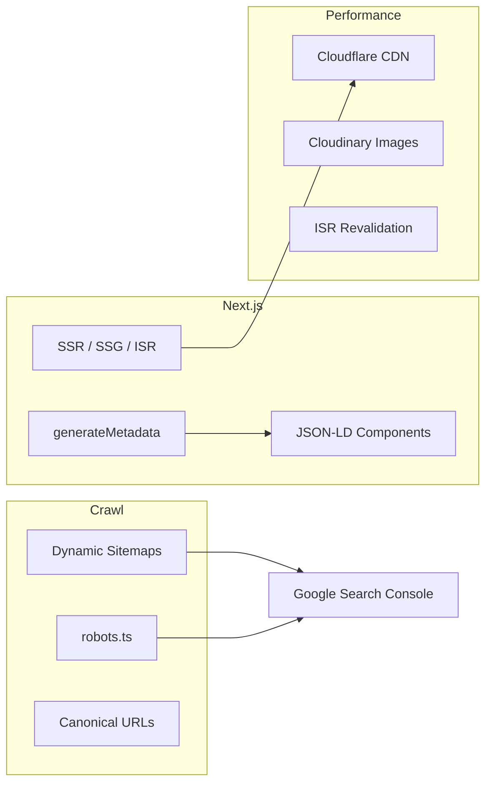
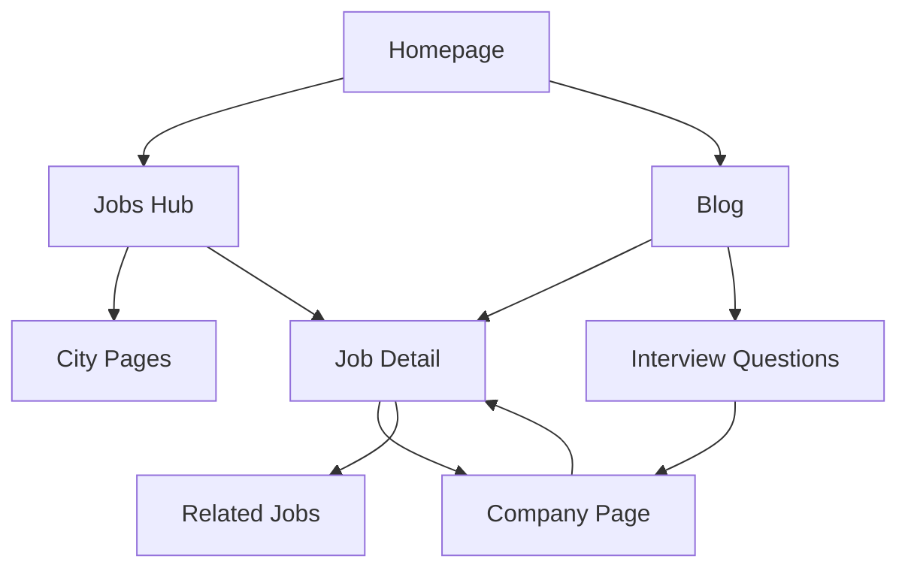

# SEO Architecture

## 1. Strategic Goals

| Goal | Target (12 mo) | Target (10M scale) |
|------|----------------|---------------------|
| Organic sessions/month | 500K | 6.5M (65% of traffic) |
| Indexed pages | 50K | 2M+ (programmatic) |
| Core Web Vitals | All green | All green |
| Domain Rating | 40+ | 60+ |

**Primary keyword clusters:**
- `{role} jobs in {city}` — transactional
- `{company} interview questions` — informational
- `campus placement tips` — informational
- `ATS resume checker India` — tool intent
- `{branch} internship` — transactional

---

## 2. Technical SEO Stack



---

## 3. Rendering Strategy by Page Type

| Page Type | Strategy | Revalidate | Rationale |
|-----------|----------|------------|-----------|
| Homepage | ISR | 300s | Fresh job counts |
| Job detail | ISR | 600s | High traffic, semi-static |
| Job listing | ISR | 120s | Filter results change |
| Blog post | SSG + ISR | 3600s | Content stable |
| Company profile | ISR | 600s | Listing count updates |
| Interview Q hub | SSG | 86400s | Rarely changes |
| Dashboard | CSR | — | noindex |
| Search results | SSR | — | noindex with query |

---

## 4. Metadata System

### `generateMetadata` Pattern

Every indexable page implements:

```typescript
export async function generateMetadata({ params }): Promise<Metadata> {
  return {
    title: `${job.title} at ${company.name} | CampusJobsHub`,
    description: truncate(job.description, 160),
    alternates: { canonical: `https://campusjobshub.com/jobs/${job.slug}` },
    openGraph: { type: 'website', images: [company.logo_url] },
    twitter: { card: 'summary_large_image' },
    robots: { index: true, follow: true },
  };
}
```

### Title Templates

| Page | Template |
|------|----------|
| Job | `{Title} at {Company} — {City} \| CampusJobsHub` |
| Internship | `{Title} Internship at {Company} \| CampusJobsHub` |
| City hub | `{Category} Jobs in {City} ({Count}+ Openings) \| CampusJobsHub` |
| Blog | `{Title} \| CampusJobsHub Blog` |
| Company | `{Company} Jobs & Internships \| CampusJobsHub` |

---

## 5. Structured Data (JSON-LD)

### Job Posting (`JobPosting`)

```json
{
  "@context": "https://schema.org",
  "@type": "JobPosting",
  "title": "Software Engineer",
  "description": "...",
  "datePosted": "2026-06-01",
  "validThrough": "2026-07-01",
  "employmentType": "FULL_TIME",
  "hiringOrganization": {
    "@type": "Organization",
    "name": "TCS",
    "sameAs": "https://tcs.com",
    "logo": "https://res.cloudinary.com/..."
  },
  "jobLocation": {
    "@type": "Place",
    "address": {
      "@type": "PostalAddress",
      "addressLocality": "Mumbai",
      "addressRegion": "Maharashtra",
      "addressCountry": "IN"
    }
  },
  "baseSalary": {
    "@type": "MonetaryAmount",
    "currency": "INR",
    "value": { "@type": "QuantitativeValue", "minValue": 600000, "maxValue": 1200000, "unitText": "YEAR" }
  }
}
```

### Other Schemas

| Page | Schema Types |
|------|--------------|
| Blog | `Article`, `BreadcrumbList`, `Person` (author) |
| Company | `Organization`, `BreadcrumbList` |
| Interview Q | `FAQPage`, `Question` |
| Roadmap | `Course` or `LearningResource` |
| Homepage | `WebSite`, `SearchAction` |
| Breadcrumbs | `BreadcrumbList` (all pages) |

---

## 6. URL & Canonical Rules

| Rule | Implementation |
|------|----------------|
| Single canonical per entity | `<link rel="canonical">` on every page |
| Pagination | Page 1 canonical = base URL; page 2+ self-canonical with `rel=prev/next` |
| Filter combos | Canonical to primary facet (city OR category, not both in URL for SEO pages) |
| Trailing slashes | 301 to non-trailing |
| HTTP → HTTPS | 301 at nginx/Cloudflare |
| www → non-www | 301 to `campusjobshub.com` |
| Expired jobs | 301 to category after 30d; 410 after 90d |

---

## 7. Sitemap Architecture

See [Sitemap doc](./03-sitemap.md).

**Automation:**
- Cron every 6 hours regenerates sitemaps
- New job publish triggers `revalidateTag` + sitemap queue
- Split at 50K URLs per file
- Submit sitemap index to GSC on deploy

---

## 8. Internal Linking Strategy



**Rules:**
- Every job links to company + category + city hub
- Blog posts include 3+ contextual internal links
- Footer links to top 20 city pages
- Breadcrumbs on all pages below depth 1

---

## 9. Programmatic SEO (Phase 2+)

### Template Pages

```
/jobs/software-engineer-jobs-in-pune
/internships/data-science-internships-in-bangalore
```

**Quality gates:**
- Minimum 3 active listings
- Unique intro paragraph (template + data variables)
- FAQ section (3–5 questions)
- noindex if listings drop below threshold

### Content Variables

- `{count}` active jobs
- `{avg_salary}` if disclosed
- `{top_companies}` list
- `{last_updated}` timestamp

---

## 10. Core Web Vitals Optimization

| Metric | Target | Tactics |
|--------|--------|---------|
| LCP | < 2.5s | Cloudinary `f_auto,q_auto`, priority hero images |
| INP | < 200ms | Code split, defer non-critical JS |
| CLS | < 0.1 | Reserved ad slots, skeleton loaders, font-display swap |

**Next.js config:**
- `images.remotePatterns` for Cloudinary
- Package import optimization for `lucide-react`, `framer-motion`
- Partial prerendering (PPR) on homepage (Next.js 15)

---

## 11. hreflang (Phase 3)

```html
<link rel="alternate" hreflang="en-in" href="https://campusjobshub.com/jobs/..." />
<link rel="alternate" hreflang="hi-in" href="https://campusjobshub.com/hi/jobs/..." />
<link rel="alternate" hreflang="x-default" href="https://campusjobshub.com/jobs/..." />
```

---

## 12. robots.ts (Dynamic)

```typescript
export default function robots(): MetadataRoute.Robots {
  return {
    rules: [
      { userAgent: '*', allow: '/', disallow: ['/api/', '/admin/', '/dashboard/', '/employer/', '/auth/'] },
      { userAgent: 'AdsBot-Google', allow: ['/blog/', '/interview-questions/', '/roadmaps/'] },
    ],
    sitemap: 'https://campusjobshub.com/sitemap.xml',
  };
}
```

---

## 13. Content Quality for SEO

| Requirement | Minimum |
|-------------|---------|
| Job description | 200 words (employer prompt) |
| Blog post | 800 words |
| Interview answer | 100 words |
| Company description | 150 words |
| City hub intro | 300 words unique |

**Thin content prevention:** Auto-flag listings < 200 words for admin review.

---

## 14. Monitoring & KPIs

| Tool | Purpose |
|------|---------|
| Google Search Console | Index coverage, queries, CWV |
| Bing Webmaster | Secondary index |
| Plausible/GA4 | Traffic (consent-gated) |
| Ahrefs/Semrush | Rank tracking |
| Custom cron | Broken link checker, orphan page detector |

**Weekly SEO report:** indexed pages, top queries, CWV regressions, crawl errors.

---

## 15. Launch Checklist

- [ ] SSL certificate active
- [ ] GSC property verified
- [ ] Sitemap submitted
- [ ] robots.txt accessible
- [ ] Canonical tags on all indexable pages
- [ ] JobPosting schema validated (Rich Results Test)
- [ ] 404/410 pages styled with internal links
- [ ] Open Graph images for all templates
- [ ] Page speed score > 90 mobile (homepage, job detail, blog)
