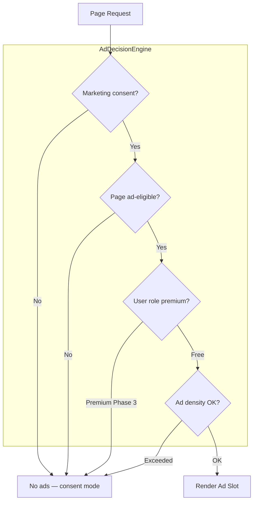
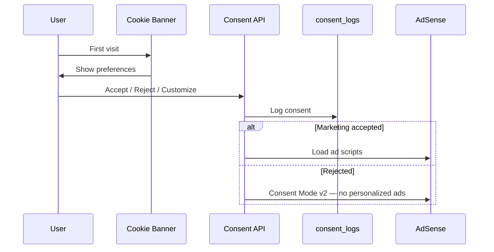

# AdSense Compliance Architecture

## 1. Overview

Google AdSense monetization on **content-rich, public pages** while maintaining policy compliance, user experience, and Core Web Vitals. Ads are a **Phase 2** revenue stream — architecture is designed from day one to avoid costly retrofitting.

**Publisher domain:** campusjobshub.com  
**Expected vertical:** Jobs & Education (sensitive — extra policy care)

---

## 2. AdSense Policy Alignment

### Content Requirements

| Requirement | CampusJobsHub Implementation |
|-------------|------------------------------|
| Original content | Blog, interview Q&A, roadmaps — no scraped content |
| Sufficient content per page | Min word counts enforced (see SEO doc) |
| Privacy policy | `/privacy-policy` with AdSense disclosure |
| Terms of service | `/terms-of-service` |
| Contact page | `/contact` with valid email |
| ads.txt | `public/ads.txt` — `google.com, pub-XXXXXXXX, DIRECT, f08c47fec0942fa0` |
| No prohibited content | Moderation queue for UGC comments |
| Navigation | Clear header/footer on all ad pages |
| No deceptive placement | Ads labeled "Advertisement" |

### Prohibited Placements

| Page / Context | Ads Allowed? | Reason |
|----------------|--------------|--------|
| `/auth/*` | ❌ | Login/register — policy + UX |
| `/dashboard/*` | ❌ | Private user area |
| `/employer/*` | ❌ | B2B portal |
| `/admin/*` | ❌ | Internal |
| `/resume/builder` | ❌ | Tool interface — distraction |
| `/resume/ats-checker` | ❌ | Tool interface |
| Application submit flow | ❌ | Conversion critical |
| `/jobs/[slug]` | ⚠️ Limited | Sidebar + below fold only (Phase 2) |
| `/blog/[slug]` | ✅ | Primary monetization |
| `/interview-questions/*` | ✅ | High RPM content |
| `/roadmaps/*` | ✅ | Long-form content |
| `/jobs` listing | ⚠️ Limited | Between results, not interrupting |
| Homepage | ⚠️ Limited | Below hero + featured jobs |

---

## 3. Ad Placement Architecture



### Slot Definitions (`src/config/ads.ts`)

| Slot ID | Location | Format | Pages |
|---------|----------|--------|-------|
| `header-leaderboard` | Below nav | Responsive | Blog, interview |
| `sidebar-rectangle` | Right sidebar | 300×250 / responsive | Blog, roadmaps |
| `in-article` | Mid-content | In-article native | Blog (after paragraph 3) |
| `between-listings` | Every 5th card | Responsive | Job listing |
| `footer-banner` | Above footer | Responsive | All eligible pages |

### Layout Rules

- **Max 3 ad units** per page view
- **Min 1500px** content between ads on long pages
- **Reserved space** (CSS `min-height`) to prevent CLS
- **No ads above fold** on mobile job detail (apply CTA priority)
- **Lazy load** ads below fold via Intersection Observer

---

## 4. Consent Management (GDPR / India DPDP)



### Consent Categories

| Category | Default (India) | Controls |
|----------|-----------------|----------|
| Necessary | On (no toggle) | Auth, security |
| Analytics | Off until opt-in | Plausible/GA4 |
| Marketing | Off until opt-in | AdSense, remarketing |

### Implementation

- `shared/components/consent/cookie-banner.tsx`
- Consent stored: `localStorage` + `consent_logs` table for logged-in users
- Google Consent Mode v2 defaults: `ad_storage: denied` until accepted
- Re-consent on policy version change

---

## 5. Ad Component Architecture

```
src/features/ads/
├── components/
│   ├── ad-slot.tsx           # Wrapper with reserved space + lazy load
│   ├── ad-sidebar.tsx
│   ├── ad-in-article.tsx
│   └── ad-between-cards.tsx
├── hooks/
│   └── use-ad-consent.ts
├── lib/
│   ├── ad-loader.ts          # Script injection (client only)
│   └── ad-eligibility.ts     # Page + consent checks
└── types.ts
```

### `AdSlot` Component Contract

```typescript
interface AdSlotProps {
  slotId: string;           // From config/ads.ts
  format?: 'auto' | 'rectangle' | 'horizontal';
  className?: string;
  lazy?: boolean;           // default true for below-fold
}
```

**Rules:**
- Never render on server (client component only)
- Show skeleton placeholder while loading
- Collapse slot gracefully if ad blocked (no empty gap)

---

## 6. ads.txt & seller.json

### public/ads.txt

```
google.com, pub-XXXXXXXXXXXXXXXX, DIRECT, f08c47fec0942fa0
```

### seller.json (Phase 2)

Hosted at `/.well-known/seller.json` for programmatic transparency.

---

## 7. Traffic Quality & Invalid Click Protection

| Control | Implementation |
|---------|----------------|
| No incentivized clicks | No "click ads to support us" messaging |
| No accidental clicks | Min 20px spacing from buttons |
| Click bombing detection | Monitor AdSense dashboard; report anomalies |
| Bot traffic filter | Cloudflare Bot Fight Mode |
| Self-click prevention | Exclude admin/team IPs in analytics |

---

## 8. Content-to-Ad Ratio

| Page Type | Min Content | Max Ads |
|-----------|-------------|---------|
| Blog post (800+ words) | 800 words | 3 |
| Interview hub | 500 words + Q&A | 2 |
| Job listing page | 10+ listings | 1–2 between cards |
| Job detail | 200+ word description | 1 sidebar (desktop only) |

**Auto noindex + no ads** if content falls below threshold.

---

## 9. Revenue Optimization (Post-Approval)

| Strategy | Timing |
|----------|--------|
| Anchor ads (mobile) | After 30 days stable CWV |
| Auto ads experiment | A/B test vs manual placement |
| Category-specific RPM tracking | Custom analytics dimension |
| Seasonal content push | Placement season (Aug–Mar) |

---

## 10. AdSense Application Readiness Checklist

### Before Applying

- [ ] 30+ published blog posts (800+ words each)
- [ ] 50+ interview question pages with full answers
- [ ] Privacy policy mentions third-party ads and cookies
- [ ] Cookie consent banner functional
- [ ] ads.txt published
- [ ] Contact, About, Terms pages live
- [ ] No broken links (crawl < 1% 404)
- [ ] Custom domain (not subdomain)
- [ ] HTTPS enforced
- [ ] No copyright violations in content
- [ ] Navigation works on mobile
- [ ] Site live for 2+ weeks with regular content updates

### After Approval

- [ ] Verify ads.txt recognized in AdSense dashboard
- [ ] Enable auto ads only after manual placement baseline
- [ ] Monitor policy center weekly
- [ ] Set payment threshold and PIN verification

---

## 11. Policy Risk Areas (Jobs Vertical)

| Risk | Mitigation |
|------|------------|
| Thin affiliate job pages | Unique descriptions, company context, related content |
| Misleading job claims | Employer verification, expiry dates |
| User-generated spam | Comment moderation |
| Accidental clicks on mobile | Adequate spacing, no ads near Apply button |
| Prohibited job categories | Block gambling, adult, weapons postings |

---

## 12. Fallback Monetization

If AdSense rejected or limited:

1. **Employer listings** (primary — Phase 2)
2. **Affiliate** — courses, books (disclosed)
3. **Direct sponsorship** — blog sidebar
4. **Carbon Ads / Ethical Ads** — developer audience fallback

Architecture supports swapping `ad-loader.ts` provider without page changes.
