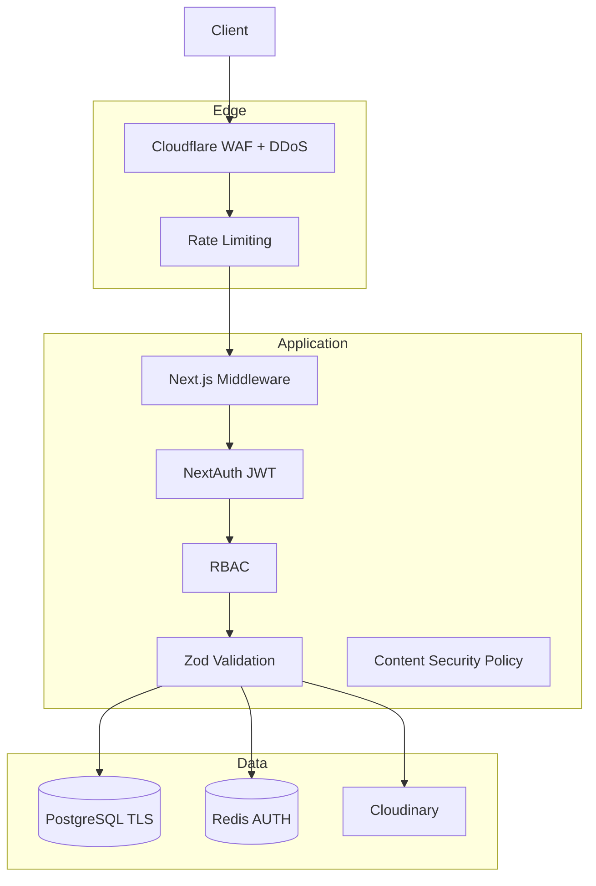

# Security Architecture

## 1. Threat Model

### Assets

| Asset | Sensitivity | Impact if Compromised |
|-------|-------------|----------------------|
| User PII (email, phone) | High | Regulatory, trust loss |
| Password hashes | Critical | Account takeover |
| Resumes (JSON/PDF) | High | Identity theft |
| Employer application data | Medium | Business confidentiality |
| Admin credentials | Critical | Full platform compromise |
| API keys (Cloudinary, SMTP) | High | Cost abuse, data leak |
| AdSense account | Medium | Revenue loss |

### Threat Actors

- Automated bots (scraping, spam applications, credential stuffing)
- Malicious employers (fake listings, phishing links)
- Disgruntled users (XSS via comments, resume injection)
- External attackers (SQLi, SSRF, RCE)
- Insider (admin abuse)

---

## 2. Security Architecture Diagram



---

## 3. OWASP Top 10 Mitigations

| Risk | Mitigation |
|------|------------|
| A01 Broken Access Control | RBAC on every API route; row-level ownership checks |
| A02 Cryptographic Failures | TLS 1.3 everywhere; bcrypt passwords; secrets in env |
| A03 Injection | Parameterized queries (ORM); Zod input validation |
| A04 Insecure Design | Threat modeling (this doc); idempotency keys |
| A05 Security Misconfiguration | Hardened nginx; no default creds; security headers |
| A06 Vulnerable Components | Dependabot; `pnpm audit` in CI |
| A07 Auth Failures | Rate-limited login; email verification; session expiry |
| A08 Data Integrity | Webhook HMAC; signed Cloudinary uploads |
| A09 Logging Failures | Structured logs; audit_logs; no PII in logs |
| A10 SSRF | Allowlist external URLs; no user-controlled fetch |

---

## 4. HTTP Security Headers

```nginx
# nginx configuration
add_header X-Frame-Options "SAMEORIGIN" always;
add_header X-Content-Type-Options "nosniff" always;
add_header Referrer-Policy "strict-origin-when-cross-origin" always;
add_header Permissions-Policy "camera=(), microphone=(), geolocation=()" always;
add_header Strict-Transport-Security "max-age=31536000; includeSubDomains; preload" always;
```

### Content Security Policy (Next.js)

```
default-src 'self';
script-src 'self' 'unsafe-inline' https://pagead2.googlesyndication.com https://www.googletagmanager.com;
style-src 'self' 'unsafe-inline';
img-src 'self' data: https://res.cloudinary.com https://pagead2.googlesyndication.com;
font-src 'self';
connect-src 'self' https://api.cloudinary.com;
frame-src https://googleads.g.doubleclick.net;
object-src 'none';
base-uri 'self';
form-action 'self';
```

CSP tightened progressively; AdSense requires specific script allowances.

---

## 5. Input Validation & Sanitization

| Input Surface | Validation | Sanitization |
|---------------|------------|--------------|
| API JSON bodies | Zod schemas | Strip unknown keys |
| Job descriptions | Max 50K chars | DOMPurify on render (HTML subset) |
| Blog content | Editor schema | Allowlist tags: p, h2, ul, a, img |
| Comments | 5000 char max | Strip HTML entirely |
| Resume JSON | Schema per section | No script fields |
| File uploads | MIME + size check | Cloudinary transformations only |
| Search queries | Max 200 chars | Escape for tsquery |

---

## 6. Authentication Security

| Control | Detail |
|---------|--------|
| Password storage | bcrypt, cost 12 |
| Session cookie | httpOnly, secure, sameSite=lax |
| JWT secret | 32+ bytes, rotated annually |
| Brute force | 5 attempts / 15 min / IP on login |
| Account enumeration | Generic "invalid credentials" message |
| Email verification | Required for apply/post |
| OAuth state | CSRF token validated by NextAuth |

---

## 7. Authorization (Row-Level)

Every data access checks ownership:

```typescript
// Example: application access
if (user.role === 'student' && application.userId !== user.id) throw Forbidden();
if (user.role === 'employer' && !ownsListing(user, application.jobId)) throw Forbidden();
```

**Never trust client-provided userId** — always derive from session.

---

## 8. API Security

| Control | Implementation |
|---------|----------------|
| Rate limiting | Redis sliding window per IP/user |
| CORS | Same-origin only (no public CORS) |
| Request size | 1MB JSON max; 5MB upload |
| Idempotency | Application submit |
| Admin routes | IP allowlist optional (Phase 2) |
| Webhook auth | HMAC-SHA256 signature header |

---

## 9. Database Security

| Control | Detail |
|---------|--------|
| Connection | TLS required; `sslmode=require` |
| Credentials | Unique app user; no superuser in app |
| Least privilege | Read-only user for replica queries |
| Backups | Encrypted at rest; access logged |
| SQL injection | ORM only; no raw string interpolation |
| PII columns | `email` CITEXT; phone optional |

---

## 10. File Upload Security (Cloudinary)

| Control | Detail |
|---------|--------|
| Upload method | Signed uploads only; no unsigned preset |
| Allowed types | image/jpeg, image/png, image/webp, application/pdf |
| Max size | 2MB images; 5MB PDF |
| Folder structure | `campusjobs/{userId}/avatars/`, `resumes/` |
| Transformations | Server-defined; no user-controlled transforms |
| Virus scan | Cloudinary add-on or ClamAV queue (Phase 2) |

---

## 11. Secrets Management

| Secret | Storage |
|--------|---------|
| `NEXTAUTH_SECRET` | Env / Hostinger secrets |
| `DATABASE_URL` | Env only; never client |
| `CLOUDINARY_API_SECRET` | Server only |
| `SMTP_PASSWORD` | Server only |
| Client-exposed | Only `NEXT_PUBLIC_*` (site URL, Cloudinary cloud name, AdSense client ID) |

**Rotation schedule:** Quarterly for API keys; immediate on suspected breach.

---

## 12. Logging & Monitoring

| Event | Log Level | Alert |
|-------|-----------|-------|
| Failed login (5+) | WARN | Slack alert |
| Admin action | INFO | audit_logs |
| 500 errors spike | ERROR | PagerDuty |
| Rate limit hit (sustained) | WARN | DDoS review |
| New employer registration | INFO | Moderation queue |

**Never log:** passwords, full JWT, credit cards, raw resume content.

---

## 13. India DPDP Act Compliance

| Requirement | Implementation |
|-------------|----------------|
| Consent | Cookie banner + `consent_logs` |
| Purpose limitation | Collect only needed fields |
| Data access | Export API (Phase 2) |
| Data deletion | Soft delete + hard delete on request |
| Breach notification | Incident runbook in `docs/runbooks/` |
| Grievance officer | Listed on privacy policy |
| IP minimization | Store SHA-256 hash, not raw IP |

---

## 14. Dependency & Supply Chain

- `pnpm lockfile` committed
- CI: `pnpm audit --audit-level=high` fails build
- Dependabot weekly PRs
- No `eval()`, `Function()`, dynamic `require` from user input
- Subresource Integrity on CDN assets where possible

---

## 15. Incident Response

| Severity | Response Time | Actions |
|----------|---------------|---------|
| P1 — Data breach | 1 hour | Isolate, rotate secrets, notify |
| P2 — Site down | 2 hours | Failover, restore backup |
| P3 — Spam wave | 24 hours | Rate limit, purge, patch |
| P4 — Minor vuln | 1 week | Patch in next release |

Runbook: `docs/runbooks/incident-response.md`

---

## 16. Security Testing

| Test | Frequency |
|------|-----------|
| `pnpm audit` | Every CI build |
| OWASP ZAP scan | Monthly on staging |
| Penetration test | Annually (pre-scale) |
| Auth flow review | Each major release |
| CSP report-uri monitoring | Continuous (Phase 2) |
