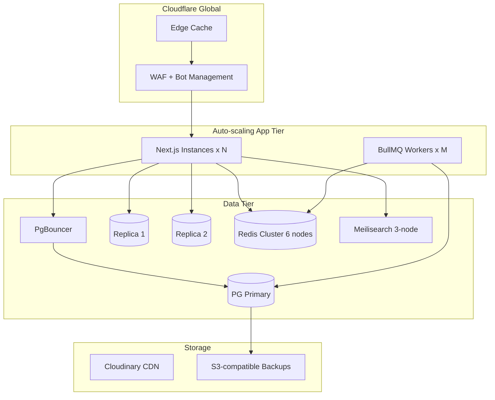
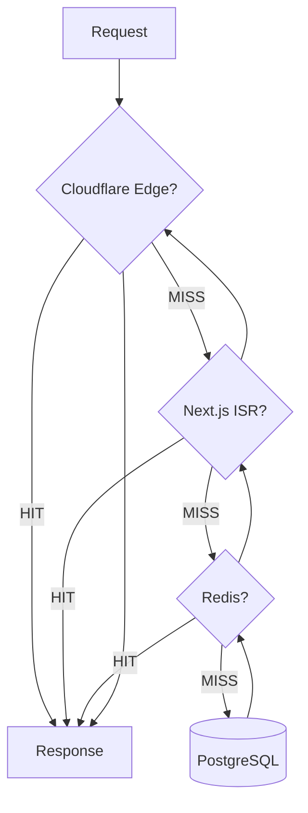
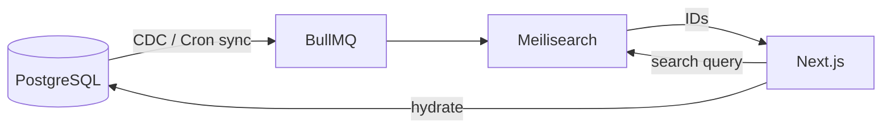

# Scalability Architecture

## 1. Scale Targets

| Metric | Phase 1 (MVP) | Phase 3 | Target (10M MAU) |
|--------|---------------|---------|------------------|
| MAU | 50K | 1M | 10M |
| DAU | 10K | 200K | 2M |
| Peak concurrent users | 500 | 10K | 50K |
| Page views/month | 2M | 40M | 400M |
| API requests/month | 5M | 100M | 1B |
| Active job listings | 5K | 100K | 500K |
| Applications/month | 10K | 500K | 2M |
| ATS scans/month | 5K | 200K | 500K |
| DB size | 10 GB | 200 GB | 2 TB |

---

## 2. Evolution Path (Hostinger VPS → Cloud-Native)

```mermaid
flowchart LR
    subgraph Phase1 [Phase 1 — Single VPS]
        VPS1[Hostinger VPS 8 vCPU / 16GB]
        PG1[(PostgreSQL)]
        REDIS1[(Redis)]
    end

    subgraph Phase2 [Phase 2 — HA Cluster]
        CF[Cloudflare CDN]
        LB[Nginx Load Balancer]
        APP1[App Node 1]
        APP2[App Node 2]
        PG2[(PG Primary)]
        REPLICA[(Read Replica)]
        REDIS2[(Redis Cluster)]
    end

    subgraph Phase3 [Phase 3 — 10M Scale]
        K8S[Kubernetes / Managed]
        MEILI[Meilisearch Cluster]
        QUEUE[BullMQ Workers]
        S3[Object Storage]
        PG3[(PG Primary + 2 Replicas)]
    end

    Phase1 --> Phase2 --> Phase3
```



---

## 3. Phase 1 — Single VPS Architecture

**Hostinger VPS spec (MVP):** 8 vCPU, 16 GB RAM, 200 GB NVMe

```
┌─────────────────────────────────────────┐
│              Hostinger VPS               │
│  ┌─────────┐  ┌──────────┐  ┌────────┐ │
│  │  Nginx  │→ │ Next.js  │  │ Redis  │ │
│  │  :443   │  │  :3000   │  │ :6379  │ │
│  └─────────┘  └──────────┘  └────────┘ │
│  ┌──────────────────────────────────┐  │
│  │         PostgreSQL 16             │  │
│  └──────────────────────────────────┘  │
└─────────────────────────────────────────┘
         ↑
    Cloudflare CDN (free tier)
```

| Component | Config |
|-----------|--------|
| Nginx | Reverse proxy, SSL termination, gzip, rate limit |
| Next.js | PM2 cluster mode, 4 workers |
| PostgreSQL | Shared buffers 4GB, max_connections 200 |
| PgBouncer | Transaction pooling, 1000 app connections → 100 DB |
| Redis | 1GB, cache + rate limits + sessions |

**Capacity estimate:** ~5K concurrent, 500K MAU with CDN caching.

---

## 4. Phase 2 — High Availability (1M MAU)

| Change | Detail |
|--------|--------|
| +1 App VPS | Nginx load balancer (round-robin) |
| Read replica | PostgreSQL streaming replication |
| Redis Sentinel | Failover for cache |
| Meilisearch | Dedicated 4GB VPS for search |
| BullMQ worker | Separate 2 vCPU VPS for async jobs |
| Cloudflare Pro | WAF, Polish, Argo |

### Read/Write Split

```typescript
// shared/lib/db/read-replica.ts
export const db = prisma;           // writes + transactional reads
export const dbRead = prismaRead;   // listing pages, search, blog
```

| Query Type | Target |
|------------|--------|
| Job listing pages | Read replica |
| Job detail (cached) | Read replica |
| Application submit | Primary |
| ATS analysis write | Primary |
| Admin dashboard | Primary |

---

## 5. Phase 3 — 10M MAU Architecture



### Infrastructure Sizing (10M MAU)

| Service | Spec | Count |
|---------|------|-------|
| App servers | 8 vCPU, 16GB | 4–8 (auto-scale) |
| Worker servers | 4 vCPU, 8GB | 2–4 |
| PostgreSQL primary | 16 vCPU, 64GB, 1TB NVMe | 1 |
| Read replicas | 8 vCPU, 32GB | 2 |
| Redis cluster | 4GB per node | 6 |
| Meilisearch | 8 vCPU, 16GB | 3 |
| PgBouncer | 4 vCPU, 8GB | 2 (HA) |

---

## 6. Caching Layers



### Cache TTL Strategy

| Data | L1 CDN | L2 ISR | L3 Redis |
|------|--------|--------|----------|
| Job detail | 5 min | 10 min | 5 min |
| Job listing | 2 min | 2 min | 2 min |
| Blog post | 1 hour | 1 hour | 15 min |
| Company profile | 10 min | 10 min | 10 min |
| User dashboard | — | — | — |
| API search | — | — | 1 min |

### Cache Invalidation

- **Write-through:** On job publish/update → `revalidateTag('job:{slug}')` + Redis DEL
- **Event-driven:** BullMQ job `cache:invalidate` with entity type + ID
- **TTL fallback:** All caches expire naturally

---

## 7. Database Scaling

### Partitioning (Already in Schema)

| Table | Strategy | Key |
|-------|----------|-----|
| applications | RANGE monthly | applied_at |
| ats_reports | RANGE monthly | created_at |
| comments | RANGE yearly | created_at |
| audit_logs | RANGE monthly | created_at |

**Partition maintenance:** Cron creates next month's partition on the 25th.

### Index Management

- `pg_stat_user_indexes` reviewed monthly
- Drop unused indexes
- Add covering indexes for hot queries
- `REINDEX CONCURRENTLY` during low-traffic windows

### Connection Pooling

```
App (1000 connections) → PgBouncer (pool: 100) → PostgreSQL (max: 150)
```

### Archival

- Jobs `expired` > 1 year → `jobs_archive` table (cold storage)
- ATS reports > 2 years → S3 JSON export + delete partition
- Audit logs > 1 year → S3 export

---

## 8. Search Scaling

### Phase 1: PostgreSQL Full-Text

- `tsvector` columns with GIN indexes
- Adequate to ~100K listings

### Phase 2+: Meilisearch



| Index | Fields | Filterable |
|-------|--------|------------|
| jobs | title, description, skills, company | city, category, experience, remote |
| internships | title, description, skills | city, ppo, stipend |
| blog | title, content | category, tags |

**Sync frequency:** Real-time on publish (queue); full reindex weekly.

---

## 9. Async Processing (BullMQ)

| Queue | Jobs | Concurrency |
|-------|------|-------------|
| `email` | Verification, application notifications | 10 |
| `ats` | Resume analysis (CPU/AI heavy) | 5 |
| `pdf` | Resume PDF generation | 5 |
| `search-sync` | Meilisearch index update | 3 |
| `sitemap` | XML sitemap regeneration | 1 |
| `analytics` | Counter reconciliation | 1 |
| `newsletter` | Weekly digest send | 2 |

**Backpressure:** If `ats` queue depth > 1000, return 503 with retry-after.

---

## 10. CDN & Static Assets

| Asset | Strategy |
|-------|----------|
| JS/CSS bundles | Cloudflare cache, immutable hash filenames |
| Images | Cloudinary `f_auto,q_auto,w_auto` + CDN |
| Fonts | Self-hosted, preload, `font-display: swap` |
| OG images | Generated via `@vercel/og` or Cloudinary |

---

## 11. Horizontal Scaling — Next.js

| Concern | Solution |
|---------|----------|
| Stateless app | JWT sessions (no sticky sessions) |
| File uploads | Direct to Cloudinary (no server disk) |
| ISR cache | Shared Redis cache handler (Phase 2) |
| WebSocket (future) | Separate socket server with Redis pub/sub |

### PM2 Cluster (VPS)

```json
{
  "apps": [{
    "name": "campusjobs",
    "script": "node_modules/next/dist/bin/next",
    "args": "start",
    "instances": "max",
    "exec_mode": "cluster"
  }]
}
```

---

## 12. Monitoring & Observability

| Tool | Purpose |
|------|---------|
| Uptime Kuma | Endpoint health (self-hosted) |
| Prometheus + Grafana | CPU, memory, request latency |
| Pino → Loki | Structured application logs |
| pg_stat_statements | Slow query detection |
| Cloudflare Analytics | CDN hit ratio, bot traffic |
| Sentry | Error tracking |

### Alert Thresholds

| Metric | Warning | Critical |
|--------|---------|----------|
| API P95 latency | > 500ms | > 2s |
| Error rate | > 1% | > 5% |
| DB connections | > 80% pool | > 95% |
| Redis memory | > 80% | > 95% |
| Disk usage | > 70% | > 85% |
| Queue depth (ATS) | > 500 | > 2000 |

---

## 13. Load Testing Plan

| Scenario | Tool | Target |
|----------|------|--------|
| Job listing browse | k6 | 10K RPS |
| Job detail | k6 | 5K RPS |
| Application submit | k6 | 500 RPS |
| ATS scan | k6 | 100 RPS |
| Search | k6 | 2K RPS |

Run before each phase transition; establish baseline on staging.

---

## 14. Disaster Recovery

| Scenario | RTO | RPO | Procedure |
|----------|-----|-----|-----------|
| VPS failure | 1 hour | 5 min | Restore from backup to new VPS |
| DB corruption | 2 hours | 5 min | Point-in-time recovery from WAL |
| Redis failure | 15 min | 0 | Cache cold start (degraded) |
| Cloudflare outage | 0 | 0 | DNS failover to origin (degraded) |
| Region outage | 4 hours | 1 hour | Multi-region (Year 2+) |

---

## 15. Cost Projection (Monthly INR)

| Phase | MAU | Infra Cost | Notes |
|-------|-----|------------|-------|
| Phase 1 | 50K | ₹3,000–5,000 | Single VPS + Cloudflare free |
| Phase 2 | 1M | ₹25,000–40,000 | Multi-VPS + Meilisearch |
| Phase 3 | 10M | ₹2,00,000–4,00,000 | Managed DB option, K8s |

**Cost optimization:** CDN cache ratio > 80%, read replica for 90% of queries, reserved instances.

---

## 16. Migration Triggers

| Signal | Action |
|--------|--------|
| Sustained CPU > 70% | Add app node |
| DB CPU > 60% | Add read replica |
| Search P95 > 300ms | Deploy Meilisearch |
| Disk > 70% | Partition archival + expand |
| Single VPS downtime | Move to Phase 2 HA |
| MAU > 800K | Begin Phase 3 planning |
