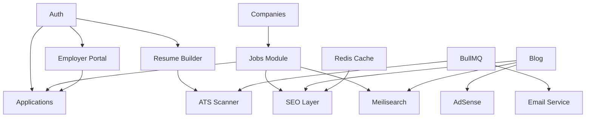

# Feature Prioritization

## Framework: MoSCoW + RICE

**MoSCoW:** Must / Should / Could / Won't (this phase)  
**RICE:** Reach × Impact × Confidence / Effort (scoring 1–10)

---

## 1. RICE Scoring Summary

| Feature | Reach | Impact | Confidence | Effort | RICE Score | Priority |
|---------|-------|--------|------------|--------|------------|----------|
| Job listing + detail pages | 10 | 10 | 10 | 5 | 200 | P0 |
| Internship listing + detail | 9 | 9 | 10 | 4 | 202 | P0 |
| User auth (email + Google) | 10 | 9 | 10 | 4 | 225 | P0 |
| Job search + filters | 9 | 9 | 9 | 6 | 121 | P0 |
| Company profiles | 8 | 8 | 9 | 4 | 144 | P0 |
| Blog CMS | 8 | 7 | 9 | 5 | 100 | P0 |
| SEO (metadata, sitemap, schema) | 10 | 10 | 9 | 5 | 180 | P0 |
| Resume builder (basic) | 7 | 9 | 8 | 8 | 63 | P1 |
| Internal applications | 8 | 10 | 9 | 6 | 120 | P1 |
| ATS resume scanner | 6 | 10 | 7 | 9 | 47 | P1 |
| Employer dashboard | 5 | 9 | 8 | 7 | 51 | P1 |
| Newsletter | 7 | 6 | 9 | 3 | 126 | P1 |
| Interview questions hub | 8 | 8 | 9 | 5 | 115 | P1 |
| Saved jobs | 6 | 7 | 9 | 2 | 189 | P1 |
| AdSense integration | 9 | 7 | 7 | 4 | 110 | P2 |
| Career roadmaps | 6 | 7 | 8 | 6 | 56 | P2 |
| Meilisearch | 7 | 8 | 8 | 6 | 75 | P2 |
| Application status tracking | 6 | 8 | 9 | 4 | 108 | P2 |
| Testimonials | 5 | 5 | 9 | 2 | 112 | P2 |
| Redis caching layer | 8 | 8 | 9 | 4 | 144 | P2 |
| Programmatic SEO pages | 9 | 9 | 7 | 7 | 81 | P2 |
| Comment system | 4 | 5 | 8 | 4 | 40 | P3 |
| Employer analytics | 3 | 7 | 7 | 6 | 24 | P3 |
| Hindi localization | 6 | 6 | 6 | 8 | 27 | P3 |
| Premium student tier | 4 | 8 | 5 | 7 | 23 | P3 |
| Mobile PWA | 7 | 6 | 7 | 6 | 49 | P3 |
| LinkedIn OAuth | 3 | 5 | 7 | 3 | 35 | P3 |
| MFA | 2 | 7 | 8 | 5 | 22 | P4 |
| Video interview prep | 3 | 6 | 4 | 10 | 7 | Won't (Y1) |

---

## 2. Phase 1 — MVP (Months 1–3)

### Must Have (P0)

| # | Feature | Acceptance Criteria |
|---|---------|---------------------|
| 1 | **Homepage** | Hero, featured jobs, categories, blog teasers, CTA |
| 2 | **Jobs module** | CRUD (admin seed), listing, detail, filters (city, category) |
| 3 | **Internships module** | Parallel to jobs with stipend/duration fields |
| 4 | **Companies** | Profile pages with linked listings |
| 5 | **Authentication** | Register, login, Google OAuth, email verification |
| 6 | **Blog** | List, detail, categories; admin publish workflow |
| 7 | **SEO foundation** | generateMetadata, JSON-LD JobPosting, sitemap, robots |
| 8 | **Legal pages** | Privacy, terms, cookie policy, disclaimer |
| 9 | **Responsive UI** | Mobile-first; Shadcn + Tailwind design system |
| 10 | **Database** | Full schema deployed; seed categories + demo data |

### Should Have (P1 — if time permits in Phase 1)

| # | Feature | Notes |
|---|---------|-------|
| 11 | Newsletter subscribe | Double opt-in |
| 12 | Saved jobs | Requires auth |
| 13 | Basic resume builder | JSON storage, 2 templates |

### Won't Have (Phase 1)

- AdSense (need content volume first)
- ATS AI (needs resume builder stable)
- Employer self-serve (admin posts jobs initially)
- Meilisearch (Postgres FTS sufficient)
- Programmatic SEO pages

### Phase 1 Exit Criteria

- [ ] 100+ seeded job listings across 10 cities
- [ ] 20+ blog posts published
- [ ] Lighthouse mobile score > 85 on 3 key pages
- [ ] GSC verified and sitemap submitted
- [ ] Auth flows tested E2E
- [ ] Zero P0 security issues

---

## 3. Phase 2 — Growth (Months 4–6)

### Must Have

| # | Feature | Acceptance Criteria |
|---|---------|---------------------|
| 1 | **Employer portal** | Onboarding, company verification, job/internship posting |
| 2 | **Applications** | Submit, status pipeline, employer inbox |
| 3 | **Resume builder v2** | 5 templates, PDF export via Cloudinary |
| 4 | **ATS scanner** | Score 0–100, keyword match, 5 scans/day limit |
| 5 | **Interview questions** | Company hubs, 100+ questions seeded |
| 6 | **Redis caching** | Job detail + listing cache |
| 7 | **Email notifications** | Application events, verification, newsletter |
| 8 | **Admin moderation** | Job/company/comment queue |

### Should Have

| # | Feature |
|---|---------|
| 9 | AdSense integration (after 30+ blog posts) |
| 10 | Testimonials section |
| 11 | Career roadmaps (3 initial: DSA, Web Dev, Data Science) |
| 12 | Application tracking dashboard for students |

### Could Have

- Programmatic city+category SEO pages
- Employer email alerts for new applications
- Comment system on blog

### Phase 2 Exit Criteria

- [ ] 50+ employer-verified companies
- [ ] 1,000+ applications processed
- [ ] ATS scanner handling 100 scans/day
- [ ] AdSense approved (or application submitted)
- [ ] 50K MAU or clear growth trajectory

---

## 4. Phase 3 — Scale (Months 7–12)

### Must Have

| # | Feature |
|---|---------|
| 1 | **Meilisearch** | Sub-100ms search across jobs, internships, blog |
| 2 | **Read replica** | Route listing queries to replica |
| 3 | **BullMQ workers** | ATS, email, PDF, sitemap async |
| 4 | **Programmatic SEO** | City+category combo pages with quality gates |
| 5 | **Multi-node app** | Load balanced Next.js instances |
| 6 | **Advanced analytics** | Admin dashboard, employer basic stats |
| 7 | **PWA** | Installable, offline blog reading |

### Should Have

| # | Feature |
|---|---------|
| 8 | Saved search + email alerts |
| 9 | Roadmap progress tracking |
| 10 | Employer freemium (2 free listings) |
| 11 | Consent Mode v2 + analytics (Plausible) |

### Could Have

- Hindi UI labels
- College email verification badge
- Direct sponsorship ad slots

### Phase 3 Exit Criteria

- [ ] 1M MAU
- [ ] P95 API < 300ms under load test
- [ ] 100K+ indexed pages
- [ ] 99.9% uptime over 30 days
- [ ] Revenue: AdSense + first employer payments

---

## 5. Phase 4 — Enterprise (Year 2+, 10M Path)

| Feature | Description |
|---------|-------------|
| Kubernetes deployment | Auto-scaling app + worker pods |
| Multi-region CDN + DB | Mumbai primary; read replicas |
| Premium student tier | Unlimited ATS, premium templates |
| Employer subscriptions | Stripe/Razorpay billing |
| API for partners | Colleges, ATS integrations |
| AI mock interviews | Voice/chat interview practice |
| Government job listings | SSC, UPSC, bank exam jobs |
| Mobile apps | React Native or Flutter |
| Data export API | DPDP compliance |
| SOC 2 preparation | Enterprise employer sales |

---

## 6. Dependency Graph

**Critical path:** Auth → Jobs → Companies → SEO → Applications → Employer Portal → ATS → Scale infra

---

## 7. Team Allocation (Suggested)

| Phase | Frontend | Backend | Content/SEO | DevOps |
|-------|----------|---------|-------------|--------|
| Phase 1 | 2 | 1 | 1 | 0.5 |
| Phase 2 | 2 | 2 | 1 | 0.5 |
| Phase 3 | 2 | 2 | 2 | 1 |
| Phase 4 | 3 | 3 | 2 | 1 |

---

## 8. Risk-Adjusted Priorities

| If this fails... | Deprioritize | Accelerate |
|------------------|--------------|------------|
| Low organic traffic | Paid ads | SEO content, programmatic pages |
| AdSense rejected | AdSense slots | Employer monetization |
| ATS costs too high | AI suggestions | Rule-based keyword ATS |
| Employer adoption low | Employer analytics | Admin-posted jobs + SEO |
| VPS limits hit | PWA, Hindi | Redis, read replica, CDN |

---

## 9. Sprint 0 Backlog (First 2 Weeks)

| # | Task | Owner |
|---|------|-------|
| 1 | Initialize Next.js 15 + TypeScript + Tailwind + Shadcn | Dev |
| 2 | Deploy PostgreSQL schema | Dev |
| 3 | Configure NextAuth (credentials + Google) | Dev |
| 4 | Design system: colors, typography, components | Design |
| 5 | Homepage wireframe → implementation | FE |
| 6 | Job listing + detail pages (static seed data) | FE |
| 7 | SEO: metadata, JSON-LD, sitemap | FE |
| 8 | Legal pages content | Content |
| 9 | Cloudflare DNS + SSL setup | DevOps |
| 10 | CI pipeline (lint, typecheck, build) | DevOps |

---

## 10. Definition of Done (Global)

- [ ] TypeScript strict mode passes
- [ ] Zod validation on all API inputs
- [ ] RBAC enforced on protected routes
- [ ] Responsive (mobile, tablet, desktop)
- [ ] Loading + error states
- [ ] SEO metadata on public pages
- [ ] No secrets in client bundle
- [ ] Audit log for admin mutations
